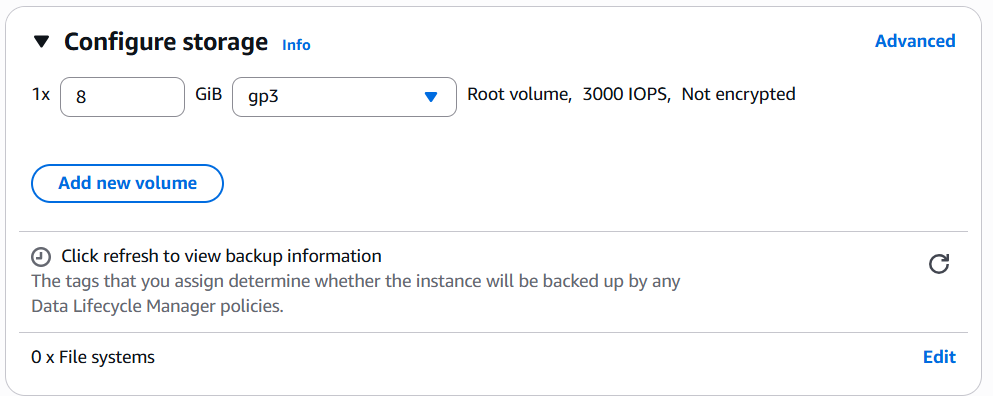
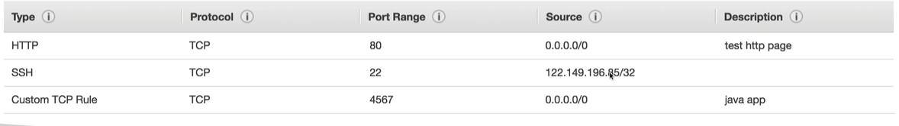
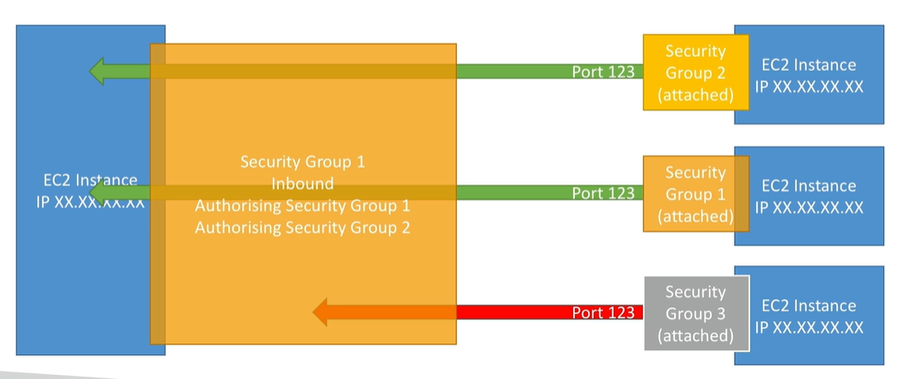
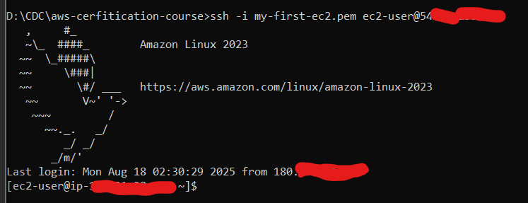
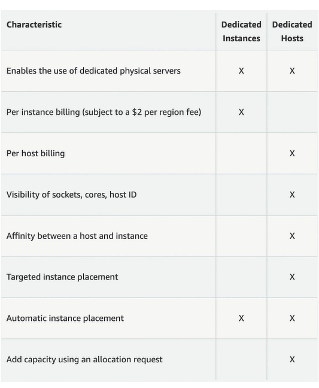

# EC2 Fundamental

## Budget setup
Setting the budget so that the credit card cannot be over charges. 
AWS will alert user if budget is exceed.

1. Activate the "IAM user and role access to Billing information" from root account by going to "account" menu
2. login to IAM user account then go to "Billing and cost management"
3. go to Budget menu and click create budget
4. fill budget setup, either simplified or advanced template. The advance can customize the time period, the start month, and specific accounts.
5. For now, lets choose simplified template.
6. AWS will offer some template\
    * Zero spend budget
    * Daily Saving plans
    * Monthly cost
    * Daily reservation utilization
7. Add title for this budget plan
8. Add email to receive the alert
9. submit.

# Amazon EC2

### Elastic Compute Cloud = Infrastructure as a Service

> IaaS is cloud computing model that provides on-demand access to computing 
> resources such as servers, storage, networking, and virtualization.\
> This eliminates the traditional infrastructure where an organization 
> should buy server, build power and cold room, and hire IT guys to maintained it.

EC2 capability consists of:
* Renting virtual machine (EC2)
* Storing data on virtual drives (EBS)
* Distributing load across machines (ELB)
* Scaling the services using an auto-scaling group (ASG)

### EC2 Sizing & Configuration options
EC2 allow user to define how big the infrastructure user needs.

* Which OS: Linux, Windows, Mac OS
* How much Power & cores (CPU)?
* How much RAM needs?
* How much storage spaced:
    * using network attached (EBS & EFS)
    * hardware (EC2 instance store)
* Network card, determine speed of the card
* What kind public IP address?
* Firewall rules: create security group
* Bootstrap script (configure at first launch): EC2 User Data

### EC2 User Data

* A script to bootstrap our EC2 instances
* bootstrapping means launching command when the machine starts
* The script will only run once at the instance first start
* Used to automate boot tasks, such as:
    * Installing updates
    * Installing software
    * Downloading common files from the internet
    * etc...
* EC2 User Data run by root user

### Instance example:

#### 1. Network Performance
This column shows how much network throughput (bandwidth) the instance can achieve for:
* Traffic between EC2 instances (within same VPC or across VPCs)
* Traffic to the internet (via Internet Gateway or NAT)
* Traffic to AWS services (like S3)

#### 2. EBS Bandwidth (Mbps)
* This is the maximum throughput to Amazon Elastic Block Store (EBS) volumes.
* Measured in megabits per second (Mbps), not megabytes — so divide by 8 for MB/s.
* Determines how fast your instance can read/write to EBS.

# Launch EC2 Instances

1. go to EC2 Service
2. go to menu instances and click launch instances
3. naming the instance
4. select base image as OS instance: Linux (Ubuntu, AWS Linux, RedHat, etc...), Windows, Mac OS
5. select instance type: t3.micro, t3.small\
    This is to determine size of memory, networking, or storage needs align with the on-demand price.
6. create a new key pair using SSH to login to the instance.
    * recommended to use .ppm format because .ppk only used for old windows (8, 7)
7. set network setting by "Allow SSH traffic from" and choose dropdown "anywhere"
8. also check "Allow HTTP traffic from the internet" so that our web can access from outside
9. configure storage by choose the right storage for our app.

> #### 1× 8 GiB gp3
> 1× → You currently have one EBS volume attached.\
> 8 GiB → The size of the disk (8 gibibytes). This will be your instance’s root disk (where the OS is installed).\
> gp3 → The volume type: General Purpose SSD (gp3).
>    * Balances price and performance for most workloads.
>    * Allows configurable IOPS (input/output operations per second).
 
> #### Root volume, 3000 IOPS, Not encrypted
> * Root volume → This is where your EC2 instance’s operating system will live.
> * 3000 IOPS → Performance setting: how many read/write operations per second it supports.
> * Not encrypted → The disk data is stored without encryption at rest (you can choose encryption if you want).

10. advance detail, we can put a script or command inside "User Data Script" input.
11. review the summary in side of screen. then hit launch instance

## About Instance Dashboard

If user select one of created instances then detail information would be shown up.
There would be:
1. Instance ID
2. Public IP Address
3. Private IP Address -> only used from internal AWS infrastructure network
4. etc...

## EC2 Instance Type

There are many instance we can choose to suite our app. Please see https://aws.amazon.com/ec2/instance-types/.
On the page, AWS provide specific instance class, like, General Purpose, Compute Optimized, Memory Optimized, Accelerated Computing, and so on...

Also, it has naming conventions:

`m5.2xlarge`

Where:
* m : is the instance class. m mean instance class for General Purpose
* 5 : the generation of the hardware. AWS will always improve it.
* 2xlarge : the instance class size. the more memory, the more CPU, and more...

## EC2 Instance Type class

### 1. General Purpose

Great for diversity of workloads such as web servers or code repositories.
Balance between:
* compute (the raw processing capability of the instance — basically, how much CPU power you get for running instructions.)
* memory
* networking

### 2. Compute Optimized

Great for compute intensive tasks that require high performance processors:
* batch processing workloads
* media transcoding
* high performance web servers
* high performance computing
* scientific modeling & machine learning
* dedicated gaming servers

### 3. Memory Optimized

Fast performance for workloads that process large data sets in memory (RAM)
* High performance, relational/non-relational databases
* distributed web scale cache stores
* In-memory databases optimized for BI (business intelligence)
* applications performing real-time processing of big unstructured data

### 4. Storage optimized

Great for storage-intensive tasks that require high, sequential read and 
write access to large data sets on local storage.
* High frequency online transaction processing (OLTP) systems
* Relational & NoSQL databases
* Cache for in-memory databases (for example, Redis)
* Data warehousing applications
* Distributed file systems

# Security Groups

Setting up a firewall network.

* Security Groups are the fundamental of network security in AWS
* Control how traffic allowed into or out of EC2 Instances
* Security groups only contain **allow** rules
* Security groups rules can reference by IP or by security group

Security groups will regulate:
1. Access to port
2. Authorized IP ranges - IPv4 and IPv6
3. Control of inbound network (from other to distance)
4. Control of outbound network (from instance to other)

Display of component security groups:

#### Good to know
1. A security groups can be attached to multiple instances
2. An instance can have multiple security groups
3. Locked down to a region or VPC combination. means the scope is limit to region or VPC combination
4. Live in outside the EC2. means act in the middle between outside and EC2. EC2 won't know if traffic is blocked
5. Its good to maintain a separate security group for SSH access
6. If our app is not accessible (timeout), then it is a security group issue
7. If our app give "connection refused", then it is application error or it is not launch
8. All inbound traffic is blocked by default
9. All out bound traffic is authorized by default

#### Whitelist inbound by security groups

Instead of relying on IP address, we can whitelist an inbound traffic by using Security Groups.
This approach can be achieved by defining the security groups name in an instance.

#### Classic ports
 * 22 SSH (secure shell) to login in linux
 * 21 FTP (File Transfer Protocol) to upload files into a file share
 * 22 SFTP (Secure File Transfer Protocol) upload files using SSH
 * 80 HTTP to access unsecure web
 * 443 HTTPS to access secured web
 * 3389 RDP (Remote Desktop Protocol) to log into windows instance

# SSH from local computer

> required Access Key. See **Generate Access Key** in module 1

1. AWS will create a default user to connect using SSH. It's called `ec2-user`
2. Connect to SSH by using terminal or Command Prompt
3. Should point provide the access key by using parameter `-i`
4. The command will looks like, `ssh -i the-path-to-access-key ec2-user@public-ip-address`
5. In Windows 11, there would be known issue with the permission of certificate, the file access should not have multiple owner.
    Hopefully, run the command prompt as administrator could solve the permission issue. If not then surf on the internet :)
6. If success, then terminal will look like:

# SSH from console

1. In EC2 service go to instances menu
2. Then click on ID of which instance would you like to access
3. In Connect info page, ensure that option EC2 instance connect is appear.
4. Choose connect using public IP address in connection type
5. Fill username with `ec2-user`, if not present
6. Then hit connect

# First thing first when connect to the Instance

## Setup IAM inside instance

> **AVOID USING `aws iam configure`, it will expose our credential.**\
> Better using IAM Role.

1. See module 1, "IAM Role" to recall how to create one
2. Inside the Role, attach which permission the role could access. For instance, to read IAM the role should have permission "IAMReadOnlyAccess".
3. Attach the Role to EC2 instance by click on "Actions" dropdown button and choose "Security"
4. There would be sub-options "Modify IAM Role" appears, hit it
5. Choose which IAM Role, and hit update button

# EC2 Instance Purchasing Options

### On-Demand Instances
> Short workload, predictable pricing, pay by second

* Pay for what you use:
    * Linux or Windows - billing per second, after the first minute
    * All other operating systems - billing per hour
* Has the highest cost but no upfront payment
* No long-term commitment

* Recommended for short-term and un-interrupted workloads, where
you can't predict how the application will behave

### EC2 Reserved Instances (1 & 3 years)
> Reserved instance - long workloads\ 
> Convertible Reserved Instances - long workload with flexible instances

* Up to 72% discount compared to On-demand
* You reserve a specific instance attributes (Instance Type, Region, Tenancy, OS)
* Reservation Period - 1 year (+discount) or 3 years (+++discount)
* Payment Options - No Upfront (+), Partial Upfront (++), All Upfront (+++)
* Reserved Instance's Scope - Regional or Zonal (reserve capacity in an AZ)
* Recommended for steady-state usage applications (think database)
* You can buy and sell in the Reserved Instance Marketplace

* Convertible Reserved Instance
    * Can change the EC2 instance type, instance family, OS, scope and tenancy
    * Up to 66% discount

Note: the % discounts could be different

### Savings Plans (1 & 3 years)
> Commitment to an amount of usage, long workload

* Get a discount based on long-term usage (up to 72% - same as Rls)
* Commit to a certain type of usage ($10/hour for I or 3 years)
* Usage beyond EC2 Savings Plans is billed at the On-Demand price

* Locked to a specific instance family & AWS region (e.g., M5 in us-east-I)
* Flexible across:
    * Instance Size (e.g., m5.xlarge, m5.2xlarge)
    * OS (e.g., Linux, Windows)
    * Tenancy (Host, Dedicated, Default)

### Spot Instances 
> Short workloads, cheap, can lose instances

* Can get a discount of up to 90% compared to On-demand
* Instances that you can "lose" at any point of time if your max price is less than the current spot price
* The MOST cost-efficient instances in AWS

* Useful for workloads that are resilient to failure
    * Batch jobs
    * Data analysis
    * Image processing
    * Any distributed workloads
    * Workloads with a flexible start and end time

* Not suitable for critical jobs or databases

### Dedicated Hosts
> Book entire physical server, control instance placement

* A physical server with EC2 instance capacity fully dedicated to your use
* Allows you address compliance requirements and use your existing server-bound software licenses (per-socket, per-core, pe-VM software licenses)
* Purchasing Options:
    * On-demand - pay per second for active Dedicated Host
    * Reserved - I or 3 years (No Upfront, Partial Upfront, All Upfront)
* The most expensive option

* Useful for software that have complicated licensing model (BYOL - Bring Your Own License)
* Or for companies that have strong regulatory or compliance needs

### Dedicated Instance
> No other customers will share user hardware

* Instances run on hardware that's dedicated to you
* May share hardware with other instances in same account
* No control over instance placement (can move hardware after Stop / Start)

### Capacity Reservations
> Reserve capacity in a specific AZ for any duration

* Reserve On-Demand instances capacity in a specific AZ for any duration
* You always have access to EC2 capacity when you need it
* No time commitment (create/cancel anytime), no billing discounts
* Combine with Regional Reserved Instances and Savings Plans to benefit from billing discounts
* You're charged at On-Demand rate whether you run instances or not

* Suitable for short-term, uninterrupted workloads that needs to be in a
specific AZ

