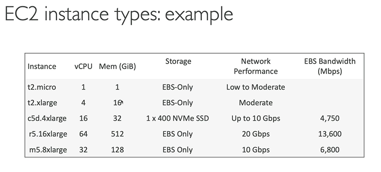

# EC2 Fundamental

## Budget setup
Setting the budget so that the credit card cannot be over charges. 
AWS will alert user if budget is exceed.

1. Activate the "IAM user and role access to Billing information" from root account by going to "account" menu
2. login to IAM user account then go to "Billing and cost management"
3. go to Budget menu and click create budget
4. fill budget setup, either simplified or advanced template. The advance can customize the time period, the start month, and specific accounts.
5. For now, lets choose simplified template.
6. AWS will offer some template\
    * Zero spend budget
    * Daily Saving plans
    * Monthly cost
    * Daily reservation utilization
7. Add title for this budget plan
8. Add email to receive the alert
9. submit.

# Amazon EC2

### Elastic Compute Cloud = Infrastructure as a Service

> IaaS is cloud computing model that provides on-demand access to computing 
> resources such as servers, storage, networking, and virtualization.\
> This eliminates the traditional infrastructure where an organization 
> should buy server, build power and cold room, and hire IT guys to maintained it.

EC2 capability consists of:
* Renting virtual machine (EC2)
* Storing data on virtual drives (EBS)
* Distributing load across machines (ELB)
* Scaling the services using an auto-scaling group (ASG)

### EC2 Sizing & Configuration options
EC2 allow user to define how big the infrastructure user needs.

* Which OS: Linux, Windows, Mac OS
* How much Power & cores (CPU)?
* How much RAM needs?
* How much storage spaced:
    * using network attached (EBS & EFS)
    * hardware (EC2 instance store)
* Network card, determine speed of the card
* What kind public IP address?
* Firewall rules: create security group
* Bootstrap script (configure at first launch): EC2 User Data

### EC2 User Data

* A script to bootstrap our EC2 instances
* bootstrapping means launching command when the machine starts
* The script will only run once at the instance first start
* Used to automate boot tasks, such as:
    * Installing updates
    * Installing software
    * Downloading common files from the internet
    * etc...
* EC2 User Data run by root user

### Instance example:

#### 1. Network Performance
This column shows how much network throughput (bandwidth) the instance can achieve for:
* Traffic between EC2 instances (within same VPC or across VPCs)
* Traffic to the internet (via Internet Gateway or NAT)
* Traffic to AWS services (like S3)

#### 2. EBS Bandwidth (Mbps)
* This is the maximum throughput to Amazon Elastic Block Store (EBS) volumes.
* Measured in megabits per second (Mbps), not megabytes — so divide by 8 for MB/s.
* Determines how fast your instance can read/write to EBS.