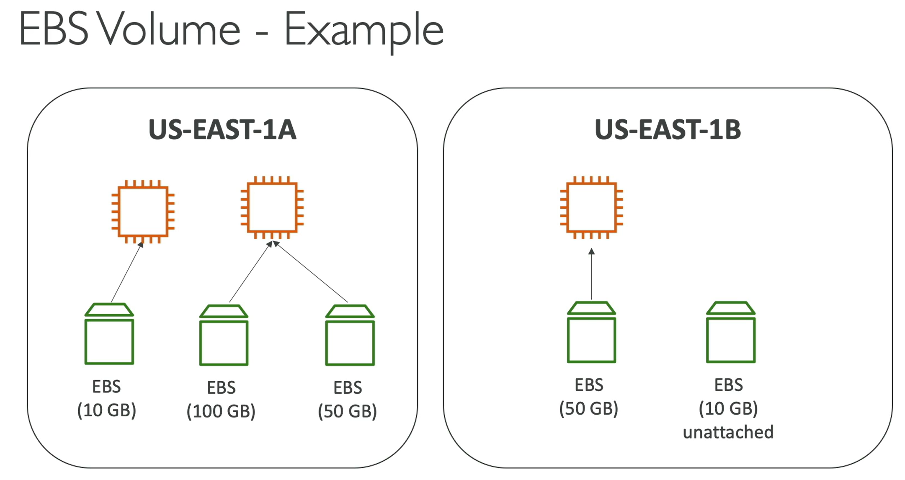

# EC2 Instance Storage

## EBS Volume

> **EBS (Elastic Block Store) volume is a network drive you can attach to your instances while they run**\
> Compare to laptop, it is like a hard drive. AWS simplified this "hard drive", so that, we can create a new volume, detach/attach to a new instance with instantly.

* Allows your instances to persist data, even after their termination
* They can only be mounted to one instance at a time (at the CCP level)
    * At Cloud Practitioner (CCP) level (beginner)
        * One EBS volume can be attached to only one EC2 instance at a time
* Bounded to a specific availability zone
    * EBS volume in us-east-1a cannot be attached to us-east-1b
    * To move it across, you have to snapshot it
* Analogy: same as like a USB stick, but it used a network instead of physical form
    * Not a physical drive
    * Use network to communicate the instance, which means there might be latency
    * Can be detached from one instance and attached to another one quickly
* Provide capacity, like size in GBs and IOPS

#### Example:

## Delete on termination

* Controls the EBS behaviour when an EC2 instance terminates
    * By default, the root EBS volume is deleted (attribute enabled)
    * By default, any other attached EBS volume is not deleted (attribute disabled)
* This can be controlled by the AWS console / AWS CLI
* Use case: preserve root volume when instance is terminated

## How to check attached EBS

1. Go to EC2
2. Select an instance
3. Go to check the "Storage" info. There should be info of "Root device details" and "Block devices"
4. Where "Root device details" is info where the root location device
5. Where "Block devices" is attach storage in the instance

## How to create a new EBS volume

1. Go to EC2 
2. Find "Volume" menu in the sidebar
3. Hit Create volume
4. Choose Volume type, size of GB, etc...
5. For **Availability Zone, should be matched with instance location or the instance wouldn't able to see the volume**
    * Go to instance information and find "Networking" info, you will find the "Availability zone"
6. If success will return to main page

## How to attach a volume

1. Go to Volumes
2. Select a volume
3. Make sure the state is ready to use
4. Find the "action" button and hit "Attach volume"
5. Select instance
6. Choose name
7. and submit
8. If you go to instance info, the new volume will be available in storage info as a new "Block device"

## How to detach a Volume

1. Go to Volumes
2. Select a volume
3. Find "detach volume" under action button
4. If success, the state will change from "In use" to "Available"

# EBS Snapshot

1. Can create a snapshot anytime
2. Not necessary to detach the volume before do snapshot, but it is recommended
3. Can copy the snapshots across regions

## Snapshot features

1. Snapshot Archive
    * Move a snapshot to an "archive tier" that is 75% cheaper
    * Takes 24 to 72 hours for restoring the archive
2. Recycle bin for EBS Snapshots
    * Setup rule to retain deleted snapshots, so it can be recovered after an accidental deletion
    * Specify retention, from 1 day to 1 year
3. Fast Snapshot Restore (FSR)\
    * Force full initialization when restore the snapshot to have no latency, but this is cost a lot of money

# AMI Amazon Machine Image

> The customization of EC2 instance

1. Add own software, configuration, operating system, monitoring, etc...
2. Faster boot / configuration time because all your software is pre-packaged
3. Built for specific region, but can copy to another
4. Can launch instance from:
    * A Public AMI : AWS Provided example AWS Linux
    * Own AMI : make and maintain by self
    * AWS Marketplace AMI : AMI created by someone (potentially sells)

## AMI Process (from an EC2 instance)

1. Start an EC2 instance and customize it
2. Stop instance (for data integrity)
3. Build an AMI - will also create an EBS snapshot
4. Launch instance from other AMIs

## How to create AMI (Image)

1. Go to the instance
2. select instance
3. Under "Action" select image and template
4. hit create image
5. Edit additional info or leave it as is
6. Submit create image

## How to create instance using our image

1. Create an instance like usual
2. In application and OS Image, choose My Image
3. And select the AMI

# EC2 Instance Store

> Temporary block-level storage for your EC2 instance. 
> This storage is provided by disks that are physically attached to the host computer.

* EBS volume has limited performance because it use network to access.
* In contrast, the Instance Store use physical volume to access. It will be attached directly to the EC2.
* Instance store very suite if we need high-performance input output
* It is provide better performance but with drawback:
    * Instance Store will lose their storage if it is stopped (ephemeral)
    * Risk of data loss if hardware fails
* Ideal for temporary storage of information that changes frequently, like: buffer / cache / scratch data / temporary content
* Backups and Replication are user responsibility not AWS
* 